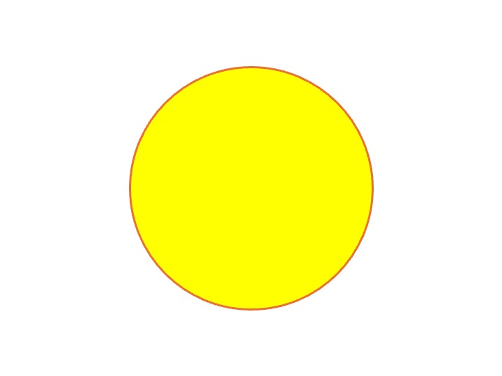

<!-- README.md is generated from README.Rmd. Please edit that file -->

# weatheRcues 

<!-- badges: start -->

<!-- badges: end -->

<p align="left">

• <a href="#overview">Overview</a><br> •
<a href="#features">Features</a><br> •
<a href="#installation">Installation</a><br> •
<a href="#get-started">Get started</a><br> •
<a href="#long-form-documentations">Long-form documentations</a><br> •
<a href="#citation">Citation</a><br> •
<a href="#contributing">Contributing</a><br> •
<a href="#acknowledgments">Acknowledgments</a><br> •
<a href="#references">References</a>
</p>

## Overview

The `weatheRcues` R code was developed to make comparison of weather
cues method on biological data, here seed production data. It integrates
existing R packages (e.g., `climwin`) alongside alternative approaches,
including methods adapted from Simmonds et al. and Thackeray et al., now
fully accessible through R code. This work is part of an ongoing study.
**Disclaimer**, `weatheRcues` is not a formal R package, but rather a
research compendium - organized with predefined files, folders
structures, functions in order to support reproducible research.

## Features

The main purpose of `weatheRcues` is to compare different methods to
identify weather cues; i.e. what triggers or inhibitors of seed
production. Feel free to adjust the code for other variable you would be
interested in, such as tree ring data, phenological data, etc.

## Installation

You can install the development version from
[GitHub](https://github.com/) with:

``` r
## Install < remotes > package (if not already installed) ----
if (!requireNamespace("remotes", quietly = TRUE)) {
  install.packages("remotes")
}

## Install < weatheRcues > from GitHub ----
remotes::install_github("ValentinJourne/weatheRcues")
```

Then you can attach the package `weatheRcues`:

``` r
library("weatheRcues")
```

## Get started

## Long-form documentations

`weatheRcues` provides for now one vignette to learn more about the
package:

- the [Get
  started](https://ValentinJourne.github.io/weatheRcues/articles/weatheRcues.html)
  vignette describes the core features of the package. Additional
  information about the methods can be found in Journé et al (in prep)

## Citation

Please cite `weatheRcues` as:

> Journé Valentin (2025) weatheRcues: a companion to identify weather
> cues in seed production. R package version 0.0.0.9000.
> <https://github.com/ValentinJourne/weatheRcues/>

And for the main study reference as:

> Journé Valentin, Emily G. Simmonds, Maciej Barczyk, Michał Bogdziewicz
> (2025) Comparing statistical methods for detecting climatic drivers of
> mast seeding

## Contributing

This code is mostly based on previous code and studies done on European
beech tree (see Journé et al, in prep for more details). Feel free to
adapt and modify the code for your own analyses and testing. If you have
any questions, suggestions, or have any issues with the code and
analysis, please do not hesitate to contact us.

## Acknowledgments

We would like to thank Martijn van de Pol, and Adrian Roberts for the
different methods they developed. We would also like Nicolas Casajus for
useful information related to code implementation.

## Main References

Bailey, L.D. & De Pol, M.V. (2016). Climwin: An R Toolbox for Climate
Window Analysis. PLoS ONE.

Roberts, A.M. (2008). Exploring relationships between phenological and
weather data using smoothing.International Journal of Biometeorology.

Thackeray, S.J., Henrys, P.A., Hemming, D., Bell, J.R., Botham, M.S.,
Burthe, S. et al. (2016). Phenological sensitivity to climate across
taxa and trophic levels. Nature.

Simmonds, E.G., Cole, E.F. & Sheldon, B.C. (2019). Cue identification in
phenology: A case study of the predictive performance of current
statistical tools. Journal of Animal Ecology.
